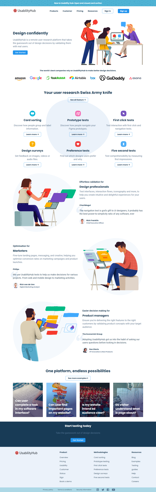

# UsabilityHub Clone
This is a project in which I created a clone of UsabilityHub's landing page.

UsabilityHub is a remote user research platform that takes the guesswork out of design decisions by validating them with real users.

## KeyFeatures
- Complete responsiveness across all devices.
- Contains a variety of sections.
- Attractive and appealing user interface.

# Technologies Used
  * HTML
  * CSS

## Screenshot

# Deployment
Application live at [UsabilityHub](https://kapadiya-gaurav.github.io/UsabilityHub-Clone/).
